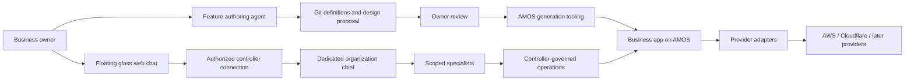
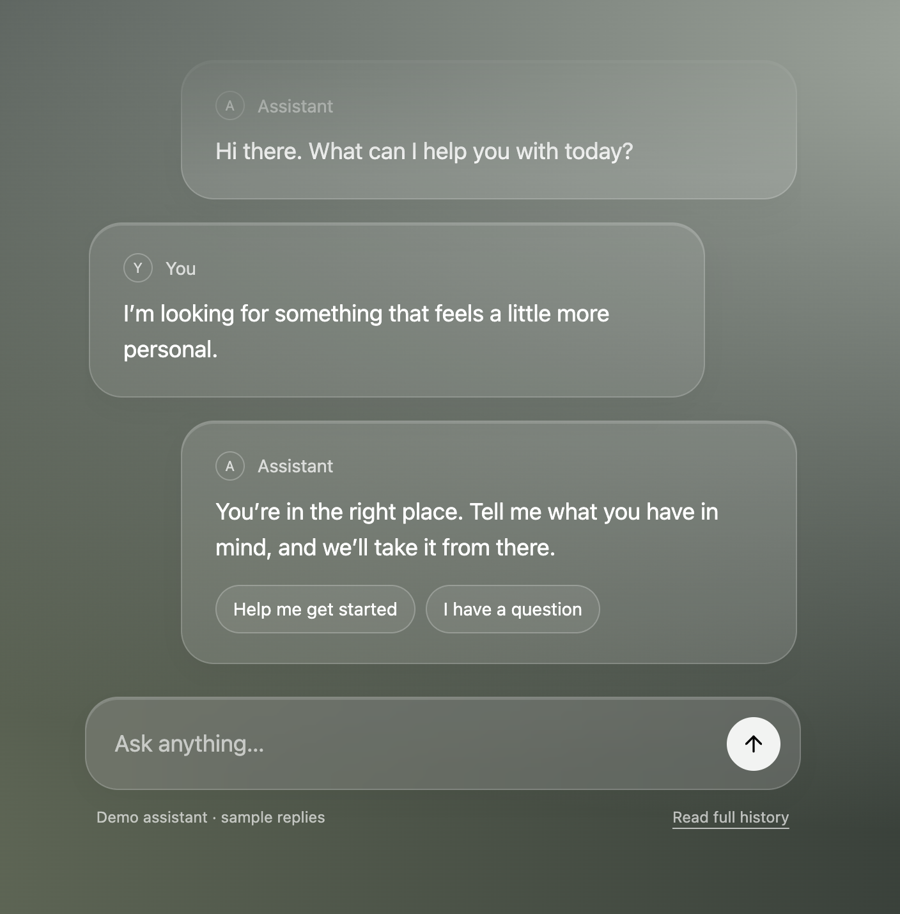
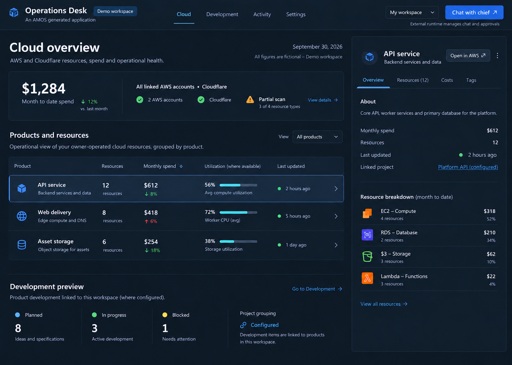

# RFC 0002: Agent-built business features and Operations Desk

Date: 2026-10-01. Status: draft for review.
Product direction: confirmed in the owner discussion; mechanisms marked proposed require review and qualification.
Extends [RFC 0001](rfc-0001.md), [the AMOS vision](../VISION.md), and [the replaceable UI contract](../contracts/ui.md).
This RFC does not authorize implementation, commits, provider access, cloud mutations, or deployment. Public AMOS artifacts describe external integrations by role and supported public contracts; closed-source project names, private source details and private endpoint registries are excluded.

## 1. Outcome

A business owner describes a feature to an agent. The agent proposes data, operations, jobs, screens and reusable components as declarative definitions in the application's Git repository. After design and implementation review, AMOS tooling generates ordinary business application code and delivers it through the existing AMOS process.

The first reference application is provisionally named **Operations Desk**. Its owner signs in and sees AWS and Cloudflare resources, inventory coverage, spend, resource-specific utilization evidence and opportunities for improvement. A live floating glass chat connects to a dedicated organization chief in an external agent runtime. Later, the same application presents product-development plans and task status.

NocoBase inspires separation of data, reusable visual blocks, actions and workflows. AMOS retains its existing architecture, languages, contracts, security and ownership. No NocoBase runtime, React dependency, component copying or license change is proposed.

## 2. Confirmed requirements and unresolved details

Confirmed requirements:

- Business owners express requirements conversationally; agents author declarative definitions and generated code.
- Definitions live in Git and use ordinary AMOS review and delivery.
- Start with the owner's cloud accounts; each later customer owns a separate AMOS installation.
- AWS and Cloudflare are the first providers. AWS starts with one main payer account and visibility into everything the installation is authorized to discover beneath it.
- Use interchangeable provider adapters, with reasonable portability of hosting and managed resources. Do not erase provider-specific capabilities.
- Cloud changes require owner approval governed by the external agent runtime. The user interfaces through live web chat in Operations Desk.
- The chat connects to a dedicated organization chief in an external agent runtime, which may delegate to cloud and development specialists.
- Use the selected dark Operations Desk visual direction and floating glass bubbles. Bubble colors adapt to the containing page.
- The owner reviews designs before implementation and commits.
- Product-development visibility follows cloud visibility.

Unresolved details include the precise initial AWS/Cloudflare resource coverage, required refresh intervals, first mutation, development-data sources, cross-provider migration pairs, and the qualified AMOS/controller identity and approval integration.

These details do not change the architectural direction. Implementation tasks must resolve the details they depend on instead of treating illustrative screenshots as requirements.

## 3. Architectural ownership

| Layer | Owns | Boundary |
|---|---|---|
| AMOS foundation | Identity, workspaces, application policy, public request boundary, delivery, maintenance and public API/MCP conventions | Cloud and project-management concepts remain optional business features |
| Feature tooling | Definition validation, deterministic generation, ownership manifests and compatibility checks | Does not bypass public AMOS contracts or grant its own authority |
| Business modules | Inventory, spend, observations, recommendations, product mappings and development projections | Own application behavior; do not establish a second task controller |
| Provider adapters | Resource discovery, observations, costs and explicitly supported effects | Preserve native details and declare missing capabilities |
| Design catalog | Reviewed tokens, components, compositions and state behavior | Presentation is never an authorization boundary |
| External agent runtime | Conversations, chief/delegation, tasks, governance, approval decisions and execution policy | Application permissions and provider restrictions still apply |

The default generated business implementation uses Go, server-rendered HTML, HTMX and plain JavaScript/CSS. AMOS's independent business-service extension remains supported where needed.



The diagram describes responsibility, not a finalized transport topology. Hosted, remote and local external runtime deployment options need an explicit supported connection design. A deployed app cannot assume it can reach a user's desktop controller.

## 4. Declarative feature definitions

### 4.1 Minimum vocabulary

Proposed vocabulary, driven by the reference application:

| Definition | Describes |
|---|---|
| Data | Entity schemas, relationships, validation, provenance and workspace scope |
| Operation bindings | Typed business operations, OpenAPI identifiers, policy metadata and exposure |
| Views | Business routes, approved components, data bindings, formatting, navigation and states |
| Jobs | Registered ingestion tasks, schedules, checkpoints and freshness expectations |
| Design | Theme token sets, component versions, composition and approval references |

Avoid a general-purpose scripting language, runtime schema engine or universal workflow editor in the first slice. Typed custom Go implementations remain appropriate where a feature cannot be expressed by the bounded vocabulary.

Definitions compose qualified adapters and components. Generating a function does not qualify its behavior or make a cloud mutation safe.

### 4.2 Contract authority

OpenAPI remains the business-operation contract. Existing AMOS policy metadata remains authoritative for operation permissions, entitlements and exposure.

The proposed feature format references those operations and schemas. If the tooling later authors an OpenAPI document, it must define a single source of truth and a derivation process; it must not maintain independent copies of operation signatures or permissions.

Example intent only; this is not an implemented schema:

```yaml
apiVersion: amos.feature/v1alpha1
kind: Feature
metadata:
  name: cloud-inventory
views:
  - id: resources
    route: /resources
    component: resource-browser
    componentVersion: 1
    operationRef: listCloudResources
    states:
      empty: no-discovered-resources
      partial: inventory-coverage-warning
      unavailable: inventory-unavailable
```

The operation reference must resolve to a reviewed public operation. The component must exist in the approved catalog. The named partial state must be bound to an explicit coverage result; a template cannot infer completeness from a successful HTTP response.

### 4.3 Generation and ownership

Generation must be deterministic for pinned definitions, component versions and generator versions. Generated files carry AMOS ownership markers and a manifest. Generated files may be replaced only under the established ownership rule; authored code and reviewed overrides are preserved.

A generated feature includes appropriate domain/API scaffolding, views, component assets, job bindings and migrations when its persistent model requires them. AMOS project migration rules govern these outputs.

Review exposes both the definition diff and consequential generated-code changes. Future maintenance and upgrades use ordinary AMOS verification and delivery rather than an unreviewable runtime editing channel.

### 4.4 Feature evolution

A feature has an immutable identity separate from display names, routes and generated paths. Renaming presentation does not recreate entities or drop data. Operation IDs and persistent schema identities remain stable unless an explicitly reviewed compatibility change provides a transition for existing callers and records.

Generation plans compare the prior accepted definition and ownership-manifest preimages with the proposed definition and current files. Plans classify additions, renames, removals, component-version changes, schema changes and affected authored overrides. Unknown compatibility, modified generated files, overlapping ownership or missing preimages stop application with an actionable conflict. Repeating generation with the same inputs produces no new migration or diff. The integrator still owns migration numbering, registry and executable wiring.

Schema evolution proposes append-only migrations under AMOS expand/contract rules; published migration bytes never change. A rename requires an explicit mapping and data-preservation check. Feature removal first disables admissions and schedules, drains or cancels in-flight work with fenced local completion, and retires public routes/operations under a reviewed compatibility policy. It does not implicitly delete retained data, drop schema, alter provider resources or remove authored files. Destructive cleanup and retention expiry require separate reviewed policy and owner gates.

Component upgrades check targeted UI/core/generator contracts and affected overrides before application. Each evolution plan includes verification, compatible rollback or forward-repair/data-restore guidance and an owner review boundary. Acceptance must exercise rename, removal with queued work, component incompatibility, authored-file conflict and persistent-schema evolution, not only initial generation.

### 4.5 Background ingestion authority

Each schedule belongs to exactly one installation/application/environment/workspace and names a registered ingestion operation, provider connection and bounded account/location/type scope. It runs as a dedicated machine actor with an explicit revocable grant; neither a stored user session nor an installation-wide administrator credential is job authority. Schedule creation requires current workspace authority. The schedule records the authorizing grant and its revision; loss of that authority suspends the schedule until a currently authorized owner explicitly reauthorizes it. Machine and provider grants may only narrow this scope. No job may silently switch credentials, workspace or provider account.

Queued payloads carry immutable job/schedule identities and scope references, not credentials or a trusted serialized principal. Before dispatch and before each provider call and local result publication, the worker resolves current authoritative machine/grant, schedule, workspace and connection state through the same AMOS policy boundary. Revoked authority, inactive authorizing membership, disabled connections or unavailable freshness stops admission and publication. Already issued remote requests may finish; their results must not become visible or advance checkpoints after authority is lost. Reauthorization creates a new admission revision; old queued attempts remain invalid. Local publication atomically checks the expected schedule/grant/connection revisions with the fenced completion and checkpoint update; a losing or stale attempt cannot commit over revoked authority or accepted newer work. The adapter must qualify this transaction boundary before scheduling real ingestion.

The initial ingestion operations are read-only against provider resources. Their grants exclude mutation and approval authority. Registered operations retain required AMOS policy/idempotency metadata; provider-changing actions remain subject to section 7.4. Runs have bounded page counts, duration, concurrency, retries and provider-call budgets, with checkpoints partitioned by workspace, connection revision and scan scope. Retries deduplicate local observations and recheck authority; an unavailable decision never becomes successful ingestion. Provider credentials are resolved only in the protected connection adapter.

Acceptance covers workspace crossover, expired/revoked machine grants, removed authorizing membership, disabled connections, queued and mid-scan revocation, unavailable policy state, duplicate delivery and stale-worker publication. Configuration of numerical limits and qualification of machine authentication are prerequisite task gates, not generator defaults.

## 5. Operations Desk domain

Proposed business entities:

- Provider connection and authorized account/location scope.
- Resource identity, kind, native configuration and relationships.
- Observation with metric, unit, time window, collection time and source.
- Cost record with period, currency, source and allocation evidence.
- Recommendation with evidence, prerequisites, uncertainty, proposed action and verification expectations.
- Product/project mapping with explicit lineage and unassigned resources.
- Scan/checkpoint with coverage, unsupported types, permission failures and freshness.

Persist only required authorized observations and metadata. Provider credentials remain in the installation's protected connection infrastructure, not in feature files, browser data or exported resource records.

### 5.1 Field selection and disclosure

Each resource type has a reviewed, versioned collection schema with explicit allowed fields, purpose, sensitivity, length/cardinality bounds and retention. Native configuration means this selected projection, never a raw provider response. Unknown fields are discarded before durable storage, including job payloads, error details and diagnostic records. Connection credentials, workload secrets, environment-variable values, user-data scripts, private keys and signed access URLs are excluded. An additional sensitive field requires a separate schema/privacy review rather than automatic inclusion after a provider API change.

Browser responses, downloadable exports and external-agent context each have a distinct explicit field allowlist within the collection schema, evaluated under current workspace/resource authority at disclosure time. A field being stored does not make it shareable. The user selects the resource and can inspect the bounded context before sending it; references are resolved server-side rather than accepting browser-supplied configuration. External conversation retention and deletion behavior must be qualified before disclosing business data, and local deletion cannot be advertised as deleting an external copy.

Provider labels, descriptions, tags and recommendations are untrusted data. Escape them in HTML, bound them in every representation and mark them as data when supplying agent context. They cannot select tools, establish authority or become approval instructions. Do not rely on redaction or prompt wording alone: enforce typed fields, payload bounds, scoped tools and the independent effect gate. Acceptance includes unexpected fields, synthetic workload secrets and instruction-like text across persistence, logs, browser, export and agent-context boundaries.

### 5.2 Inventory coverage

"See everything" is the user outcome, not a false universal provider promise. An inventory screen shows accounts and regions attempted, supported resource types, last successful collection, permission failures, unsupported capabilities and unknown coverage.

A payer identity does not itself establish successful resource access to every linked account. Discovery and per-account authorization must be demonstrated. Global resources, region-specific resources, pagination and incomplete scans remain explicit.

Partial results are useful and visible, but never labelled complete. Unassigned resources remain browsable rather than disappearing because no product mapping exists.

Every scan has an immutable ID, a monotonically assigned generation within its reconciliation scope, the connection/authorization revision, and exact provider/account/location/resource-type coverage. A scope may reconcile absence only after its qualified adapter confirms all required pages completed with unchanged authority and scope and no denied, unsupported, interrupted or unknown coverage. A partial scan may update successfully observed resources, but it cannot advance the complete-scan checkpoint or mark unseen resources absent. Resource updates are generation-fenced so an older overlapping scan cannot overwrite newer observations or presence state.

Absence from one complete listing produces `not_observed`, not `deleted`, and retains the prior observation with its collection time. `deleted` requires a qualified resource-specific authoritative deletion signal or direct absence check that distinguishes missing from denied/unavailable. Without such a capability, repeated absence remains `not_observed`. An incomplete later scan must display current unknown coverage even if an earlier scan was complete. A verified deletion retains a tombstone and provenance; rediscovery reactivates the same resource incarnation, while provider identifier reuse is recorded as a new incarnation without reusing the AMOS ID.

Removing a connection or narrowing its scope stops collection and marks retained records outside current coverage; it does not prove provider deletion or broaden visibility. Resource observations, scan evidence and tombstones each require an explicit owner-reviewed retention period and export/deletion policy before persistent ingestion. Retention expiry never implies a cloud mutation. Recommendations and action plans must revalidate resource existence, incarnation and current observations before execution.

Acceptance covers complete then partial scans, interrupted pagination, denied accounts, scope narrowing, older scans finishing last, eventual-consistency absence, verified deletion and rediscovery/identifier reuse. Historical observations remain distinguishable from current inventory.

### 5.3 Spend and utilization

Inventory and billing are separate projections with separate freshness. Account/service spend may not be attributable to individual resources. Show unattributed totals and allocation assumptions rather than invented precision.

Separate actual, estimated and forecast costs, and preserve currencies. A cross-currency total requires an explicit conversion policy and date.

Utilization is resource-specific. CPU, memory, storage, requests, capacity, error rates and latency are not one interchangeable percentage. Unsupported observations display unknown or unavailable, never zero. Observation windows accompany recommendations.

Low CPU alone does not justify resizing. Recommendations require relevant capacity, workload and reliability evidence, uncertainty and a bounded supported action. The mock's provisioned-capacity comparisons are illustrative and must be replaced with provider-appropriate semantics.

## 6. Provider adapters and portability

Adapters expose declared capabilities rather than a universal interface in which every method supposedly works. Distinguish resource discovery, metrics, costs, pricing, action planning, action execution and outcome verification. Contract shape and ownership of execution must be settled against AMOS and the external agent runtime before implementing mutations.

Retain normalized identity and relationships alongside native IDs and bounded provider details. Preserve resource-specific controls through explicit capability extensions. Unsupported capability errors remain understandable in web/API/MCP views.

Three portability goals are distinct:

1. **Application hosting:** public contracts, exportable application data and provider-specific deployment profiles permit additional supported hosting targets.
2. **Observation providers:** additional adapters populate compatible domain projections while retaining native details.
3. **Managed-resource migration:** only named, tested resource pairs qualify. A migration plan describes compatibility gaps, data transfer, downtime, cost, verification and recovery; data-path equivalence is not assumed.

This RFC preserves existing AWS/Cloudflare-first deployment requirements. It does not claim that existing deployment implementations are already portable, nor require a cross-provider migration engine before useful inventory ships.

## 7. External chief and live web chat

### 7.1 Agent selection

Bind each customer installation to its own external runtime organization and designated chief. For the first installation, use a dedicated Operations chief rather than the owner's general personal chief.

Proposed cloud and development specialists are roles to configure and qualify, not agents claimed to exist today. The chief keeps the user-facing conversation coherent and delegates through the qualified controller adapter. Display delegated ownership and durable task state when useful; this RFC does not assert that any particular runtime already supplies these capabilities.

Never select a chief by a free-text model response or an untrusted browser-provided worker ID. The server resolves the configured binding under current user/workspace authority.

### 7.2 Identity and connection

An AMOS login does not automatically grant external runtime conversation access. Define the individual-user principal mapping, organization/workspace binding, revocation, conversation membership, transport and credentials explicitly.

Keep privileged controller and provider credentials out of the browser. Do not use one unrestricted chief credential to proxy every customer user's chat.

A server-side bridge is proposed to translate the application's authorized user request into supported external controller operations. Its exact authentication and scope-delegation mechanism is an adoption gate; inventing a token or protocol is not acceptable.

### 7.3 Durable conversation and streaming

Use a qualified adapter for message admission, authorized durable history and reply-preview streaming where supported. The adapter must pin a supported public controller contract and deployment profile and verify their behavior against a real controller. No private endpoint or registry is an AMOS interface requirement; unsupported streaming remains explicitly unavailable.

Distinguish message submission from observing replies. Reconnect resumes observations and retrieves authorized durable history; it must not resubmit a mutation. Use the actual contract's deduplication/version rules rather than an invented header.

Streaming previews are transient and may disappear on restart. They are not durable completion evidence. Render persisted messages and committed controller task/review state as authoritative.

### 7.4 Context and approvals

A selected resource or product can become an explicit context chip in the composer. Send stable references and bounded authorized context after user intent, using the disclosure rules in section 5.1; do not silently transmit unrestricted page contents or credentials.

A user can ask, for example, "Why is this resource expensive?" or request a supported change. The chief investigates and presents a proposal through external runtime governance.

Approval requests and decisions may be rendered in the web conversation. Their state and enforcement remain controller-owned. A model sentence, decorative button or local UI flag never proves approval.

The approved proposal must remain bound to the relevant actor, operation, resource, input, scope and validity constraints supported by the actual contracts. If that integration is unavailable, mutation functionality remains unavailable.

AMOS still checks current application permission, workspace scope, entitlements and provider constraints at the effect boundary. External runtime approval cannot create an application grant. Verification distinguishes successful, failed and unknown physical outcomes; ambiguous outcomes are reconciled before retry.

## 8. Design system and review

### 8.1 Owner review gates

Review happens before production implementation and Git commits:

1. Visual directions for the app shell, navigation and representative screens.
2. A clickable local prototype and component gallery.
3. Complete feature flows including data semantics, responsive behavior and failure states.
4. Explicit owner approval of implementation scope and subsequent commit boundary.

A local prototype is a design artifact, not release evidence. Its production data access is disabled unless separately authorized. Approval of this draft is not a production commit or deployment instruction.

Definitions bind approved components to data and operations. Tokens, components, state contracts and significant custom overrides are versioned. New components and substantial changes return for review. Automatic reuse of approved components needs an agreed policy; it is not assumed here.

### 8.2 Floating glass bubbles

Preserve the selected dark Operations Desk layout. The chat is a floating lower-right composer with recent bubbles above it and an expandable history mode. It must remain dismissible and avoid permanently obstructing the resource inspector. On narrow screens, use an appropriate full-height conversation presentation.

The supplied glass-chat reference uses HTML, CSS, HTMX, blur, translucency, soft message transitions and a history control. Its fake reply path must not appear as a live connection.

Bubble colors adapt to the page's explicit design tokens, not a fixed dark-only palette. Proposed semantic tokens include:

- `chat.surface`, `chat.surfaceOpacity` and `chat.backdropBlur`;
- `chat.text`, `chat.mutedText`, `chat.border` and `chat.accent`;
- separate user/assistant emphasis, focus and status tokens.

Resolve these from the active page theme and deliberate local overrides. Prefer page-aware CSS variables and color mixing over reading underlying DOM content or sampling arbitrary screen pixels.

Provide dark, light and contrasting-background review fixtures. If translucent surfaces cannot maintain readable contrast, increase opacity or use an opaque fallback. Blur is an enhancement, not a prerequisite. User and assistant identity cannot depend on color alone.

Respect reduced motion, keyboard access, visible focus, readable full history, accessible message announcements and selection/copying. Connection loss, denied access, pending response and unknown operation outcomes must be explicit.

### 8.3 Reference qualification

The owner corrected the initial screenshot reference and supplied the actual bubble screenshot, which was inspected directly. It shows wide translucent bubbles, large rounded corners, thin light borders and highlights, alternating user/assistant alignment, restrained circular identity marks, pill-shaped suggestions and a glass composer with a circular send control. Preserve those visual relationships rather than freezing its gray-green backdrop color.



This screenshot is the chat appearance reference. The selected application-shell direction is shown below; its figures and resource metrics are fictional and illustrative, not requirements for provider behavior.



Use the soft history fade only in the compact preview. Full history must be unfaded, readable, selectable and keyboard-accessible. In a real resource table, reserve a usable chat footprint or expand to a dedicated conversation view rather than blur away information the user needs to inspect.

Browser policy blocked opening the local reference URL; direct screenshot and source inspection establish the intended appearance, not a rendered implementation-fidelity comparison. The clickable adaptive-theme prototype remains a design-review gate.

## 9. Development visibility

Add a business module for plans, pending work, todo, in-progress, blocked and completed states after useful cloud visibility.

Candidate sources are repository plan files, GitHub issues/projects/PRs and external controller work records. Choose the source of truth and precedence before implementation. Preserve original source status, identity, links and observation time. Do not infer completion from a PR title, an agent's prose or a missing item.

Product mappings can connect development work to cloud resources and spend. Mappings are explicit, imported from evidence or reviewed suggestions. Operations Desk is a projection and navigation surface; it does not silently replace source systems or create a second external controller task graph.

## 10. Delivery and acceptance

Existing AMOS foundation and release dependencies remain in force. A working screen does not establish complete identity, billing, deployment or agent qualification.

| Slice | Reviewable result | Required evidence |
|---|---|---|
| Design | Selected shell, adaptive bubble chat and component/state gallery with synthetic data | Owner review; dark/light/narrow-screen/keyboard states; selected screenshot matched in the prototype |
| Definitions | One minimal feature generated and evolved through public AMOS seams | Determinism/no-op regeneration, contract/policy resolution, rename/removal, queued-work retirement, component compatibility, schema migration/recovery and authored-file conflict stops |
| Ingestion authority | Workspace-scoped read-only schedules and dedicated machine grants | Queued/mid-scan revocation, membership loss, disabled connections, policy unavailability, duplicate delivery, fencing and bounded provider calls |
| Data disclosure | Versioned collection and separate output/context allowlists | Unexpected-field rejection; synthetic secrets absent from storage/logs/browser/exports/context; current authority, untrusted text and external retention behavior |
| AWS inventory | Authorized resources and explicit account/region/type coverage | Pagination, partial/interrupted/overlapping scans, scope narrowing, absence versus verified deletion, incarnation reuse, stale data and workspace isolation |
| Spend | Honest totals, trends and allocation | Reconciliation to source periods; actual/estimate distinction; unattributed costs remain visible |
| Utilization | Resource-specific observations and recommendations | Relevant windows, missing metrics and provider-supported semantics; no CPU-only safety claim |
| Live chat | Dedicated-chief binding, admission, history and preview stream | User scope, revocation, reconnect, denied access and durable-state behavior against a real supported controller |
| Approved effect | One bounded supported mutation | Controller approval binding, application denial, stale proposal, unknown outcome and independent verification |
| Cloudflare | Appropriate service inventory/cost/observation capabilities | Explicit unsupported features, source reconciliation and consistent domain projections |
| Development | Source-backed statuses and product mapping | Source precedence, stale/denied states, status provenance and no duplicate task ownership |
| Customer/portability | Independent installation and a named alternative | Isolation/export/recovery and demonstrated adapter or hosting substitution; migration evidence per resource pair |

Ordering may change with explicit owner priorities and satisfied dependencies. Initial mutation selection must resolve reversibility, cost, authority and recovery. No mutating provider operation follows merely from approving a UI.

## 11. Alternatives and tradeoffs

- **Embed NocoBase:** potentially faster access to a broad builder, but adds another runtime, frontend model and ownership boundary. Rejected for this scope; inspiration only.
- **Interpret all definitions at runtime:** flexible editing, but a new runtime engine and migration/security surface. Prefer generated ordinary code and normal AMOS delivery.
- **Connect directly to a cloud specialist:** focused, but fragments the later development conversation. Prefer a dedicated chief with scoped specialists.
- **Use the personal chief:** fewer assistants, but wider context and authority. Prefer the customer-installation-specific chief.
- **Put approvals in AMOS:** duplicates the external runtime governance boundary. Render controller-owned approval state through chat instead.
- **Normalize away all vendor details:** looks portable but hides real capability differences. Keep a common domain plus explicit native details.
- **Automatically sample page pixels for colors:** adds complexity and unpredictable contrast. Use reviewed semantic theme tokens.

## 12. Adoption gates and open questions

Before implementation:

- Approve the definition vocabulary, authoritative-contract mapping, component versioning and feature-evolution compatibility/recovery rules.
- Qualify machine job admission and revocation against AMOS policy; set ingestion limits and connection-scope rules.
- Review field allowlists, disclosure destinations and retention periods; qualify each adapter's complete-scan and authoritative-deletion semantics.
- Review the prototype against the supplied bubble screenshot and adaptive-theme states.
- Choose development sources, first resource coverage, freshness targets and first approved action.
- Qualify the external runtime deployment/transport, per-user authorization, chief binding and operation-bound approval mechanism.
- Define exportable configuration/data and one concrete portability proof.

This RFC is an architectural proposal and future planning input. It does not rewrite the accepted execution-state registry, dispatch new implementation lanes, waive existing independent verification or declare a completed integration.

## 13. Evidence and follow-up record

Local evidence inspected:

- AMOS: `docs/VISION.md`, `docs/runtime.md`, `docs/codegen.md`, `docs/contracts/ui.md`, `docs/plans/E6.md`, `docs/RESUME.md` and RFC 0001.
- NocoBase: v2 `BlockModel`/`PageModel`, `FlowEngine`, database collection, main data-source and workflow plugin structures.
- External integration requirements in this RFC are proposed contracts to qualify using public documentation and real supported-controller checks. Private source inspection and endpoint registries are not public AMOS evidence or interface dependencies.
- The generic glass-chat screenshot and its HTML/CSS/JavaScript reference informed presentation only; no private implementation is an AMOS dependency.
- Owner discussion, the inspected glass-bubble screenshot and selected Operations Desk mock. The shell reference uses neutral integration labels. Only these relevant, synthetic/generic references are included; unrelated screenshot content and private local paths are omitted.

The earlier planning proposal is supporting discussion, not a replacement for this RFC. Update the implementation plan only after adoption and dependency review. Accepted design and integration decisions should receive the project's ordinary durable decision record.


### Review resolution (2026-10-01)

The document review identified four missing lifecycle contracts. Sections 4.5, 5.2, 5.1 and 4.4 now specify background-job authority/revocation, scoped scan reconciliation and deletion evidence, field selection/disclosure, and feature evolution respectively. Delivery and adoption gates include their negative cases. External integrations are described by role; closed-source project names and private endpoint details are excluded. These are draft design resolutions, not adoption, implementation or provider qualification. Accepted execution-state statuses are unchanged.
